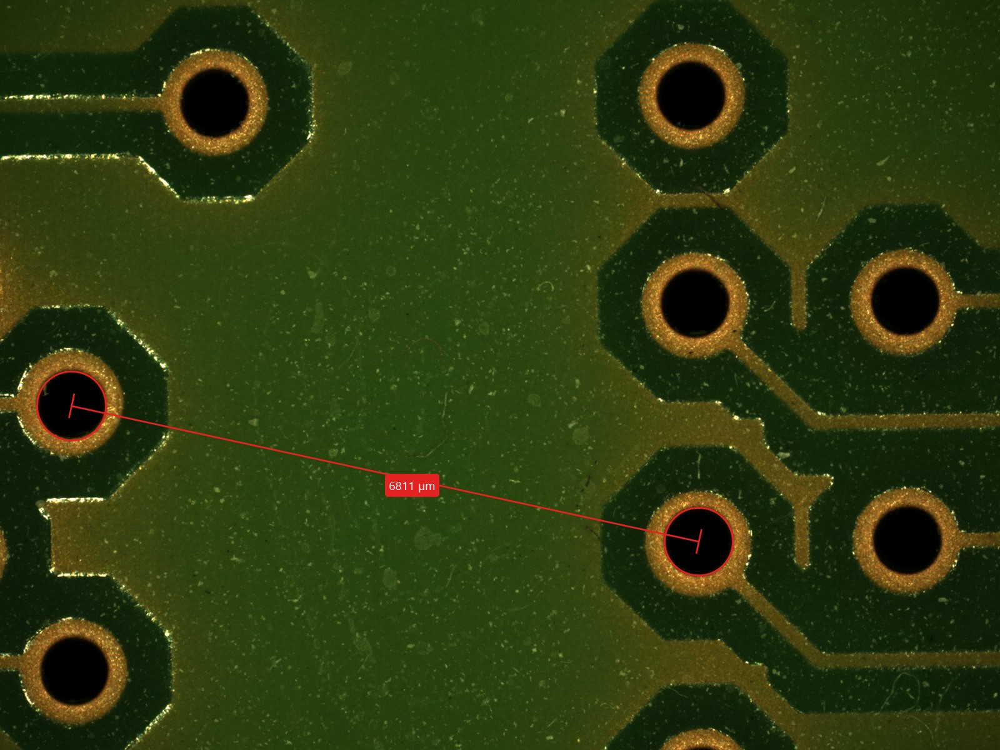

# Distance-measure-on-microscope-data

This is a project I worked for using the Zeiss smartzoom 5 microscope. 

The task was such: givin an image, and known image scale, User want to measure distance on circuit board from hole to hole, and to perfectly center the hole, user want to define three point on the boundry of the circle and software will automatically find the center of the circle. 

for finding the center of the circle, I referenced geeksforgeeks's method : https://www.geeksforgeeks.org/equation-of-circle-when-three-points-on-the-circle-are-given/

This code right now is set up for Zeiss smartzoom 5 using 37x, 70x, and 100x. the software will automaticlly find the image scale and begine measurement, for other microscope image, please define your own units as in pixel per micron.

